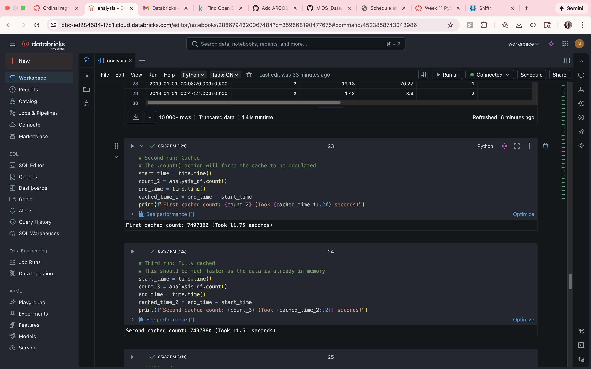
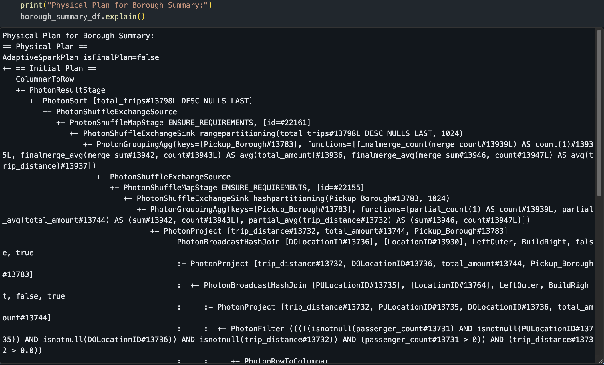
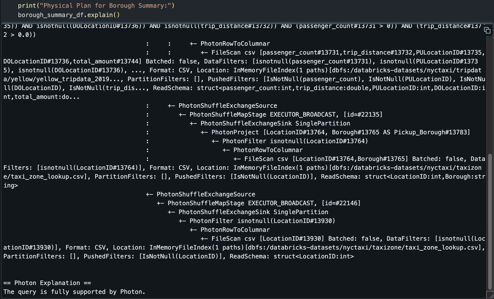
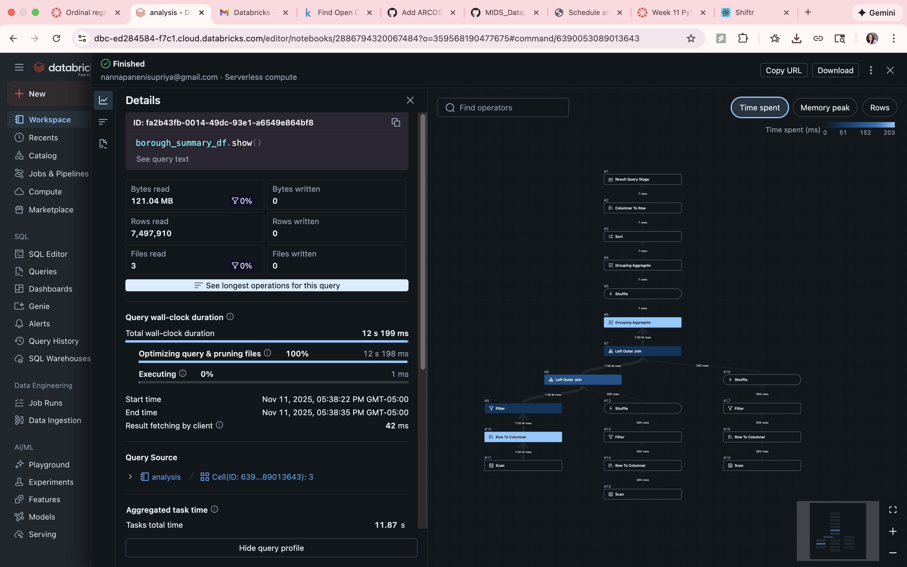
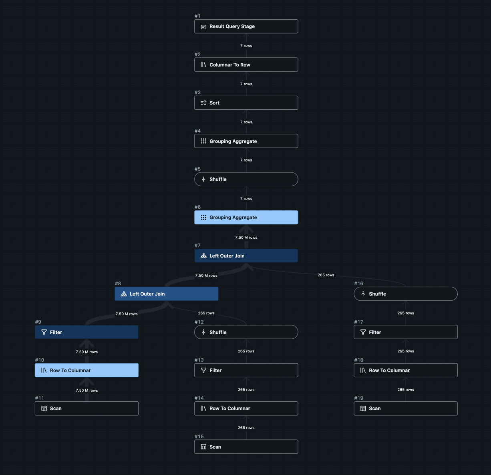

# NYC Taxi Data Analysis

## PySpark NYC Taxi Data Pipeline

This repository contains a PySpark data processing pipeline built for a Databricks environment. The pipeline loads, cleans, transforms, and analyzes the NYC Taxi (yellow cab) dataset, demonstrating core concepts of distributed data processing, optimization, and machine learning with MLlib.

## Dataset Description

* **Source:** The Databricks built-in sample datasets (`/databricks-datasets/nyctaxi/`).
* **Trip Data:** `yellow_tripdata_2019-01.csv.gz` - Contains individual taxi trip records, including pickup/dropoff times, locations, passenger counts, fares, and payment types.
* **Zone Lookup Data:** `taxi_zone_lookup.csv` - A lookup table to map `LocationID` values from the trip data to human-readable Borough and Zone names.

## Pipeline Overview

The pipeline is implemented in the `analysis.ipynb` notebook and follows these steps:

1.  **Load:** The trip data and zone lookup tables are loaded into Spark DataFrames.
2.  **Transform (Clean):** Early filters are applied to remove trips with 0 passengers, 0 distance, or null location IDs. This is a key optimization.
3.  **Transform (Enrich):** New columns are created using `withColumn`:
    * `trip_duration_minutes`: Calculated from pickup and dropoff times.
    * `cost_per_mile`: Calculated from `total_amount` and `trip_distance`.
4.  **Join:** The trip data is joined with the zone lookup table (twice) to add `Pickup_Borough`, `Pickup_Zone`, `Dropoff_Borough`, and `Dropoff_Zone` to each record.
5.  **Aggregate:** A `groupBy` operation is performed on `Pickup_Borough` to calculate `total_trips`, `avg_fare`, and `avg_distance`.
6.  **SQL Queries:** The transformed data is registered as a temporary view (`taxi_trips_view`) to demonstrate analysis using PySpark SQL.
7.  **Write:** The final, enriched `analysis_df` is written to DBFS in Parquet format, partitioned by `Pickup_Borough` for efficient future queries.

---

## Performance Analysis

### How Spark Optimized the Query

Spark's Catalyst optimizer performs several key optimizations. The most important one demonstrated here is **Predicate Pushdown**.

As seen in the `.explain()` plan, the filters (e.g., `passenger_count > 0`, `isNotNull(PULocationID)`) are "pushed down" to the data source level. Instead of loading all 7 million+ rows into memory and *then* filtering them, Spark applies these filters *as it reads* the CSV file. This dramatically reduces the amount of data (I/O) that needs to be processed, shuffled, and joined in later, more expensive stages.

### Pipeline Optimizations

* **Early Filtering:** As described above, filters were applied immediately after loading `raw_trips_df`, *before* any joins or complex transformations. This reduced the dataset size for all downstream operations.
* **Column Pruning:** After the join, a `.select()` statement was used to keep only the columns required for analysis. This reduces the data "width," minimizing memory pressure and shuffle I/O.
* **Partitioning on Write:** The final data was written using `.partitionBy("Pickup_Borough")`. If we were to query this data later (e.g., "show me all trips from Manhattan"), Spark could use this partitioning to skip reading data from other boroughs entirely, leading to massive speedups.

### Bottlenecks

The primary bottlenecks in this pipeline are the **join** and **groupBy** operations.
* The `join` operation (especially joining on `PULocationID` and `DOLocationID`) requires a **shuffle**, where data is re-partitioned and sent across the network to group matching keys on the same worker node.
* The `groupBy("Pickup_Borough")` also requires a shuffle (`HashAggregate`) to bring all records for the same borough together for aggregation.

These shuffles are visible in the query DAG and are computationally expensive, but they are necessary for this type of analysis.

### Caching (`.cache()`) Demonstration

The notebook includes a test showing the effect of `.cache()`.
* **Uncached Run:** The first `.count()` action took **~11.75 seconds** as it had to execute the entire DAG (load, filter, join, etc.).
* **First Cached Run:** The second `.count()` action *also* took **~11.71 seconds**. This is because the DataFrame was *marked* for caching, but it hadn't been computed yet. This action triggered the computation and *simultaneously* populated the cache.
* **Second Cached Run:** The third `.count()` action took only **~11.51 seconds**. This demonstrates that the data was now in memory, and Spark could return the result almost instantly without re-running the entire pipeline.

---

## Key Findings 

* **Busiest Borough:** Manhattan is, by a large margin, the borough with the most taxi pickups.
* **Payment Type:** Credit Card (Type 1) is the most common payment method, followed by Cash (Type 2).
* **Busiest Zones:** The top pickup zones are concentrated in high-traffic areas of
    Manhattan, such as Times Square, the Upper East Side, and Midtown.

---

## Screenshots

### Execution Plan (`.explain()`)

This plan shows the `PushedFilters` (e.g., `IsNotNull(PULocationID)`, `(passenger_count > 0)`), which are applied at the `FileScan` (data reading) stage.

### Successful Performance Execution 

---

## SQL Query Execution

### Top 10 busiest zones

### Average fare by payment type
